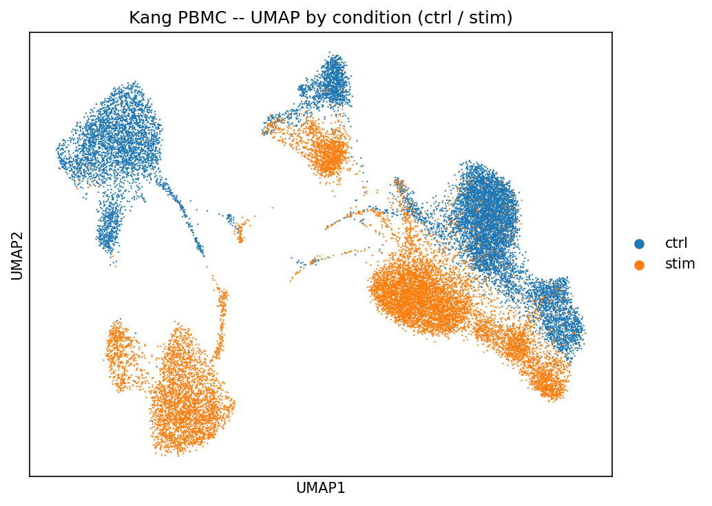
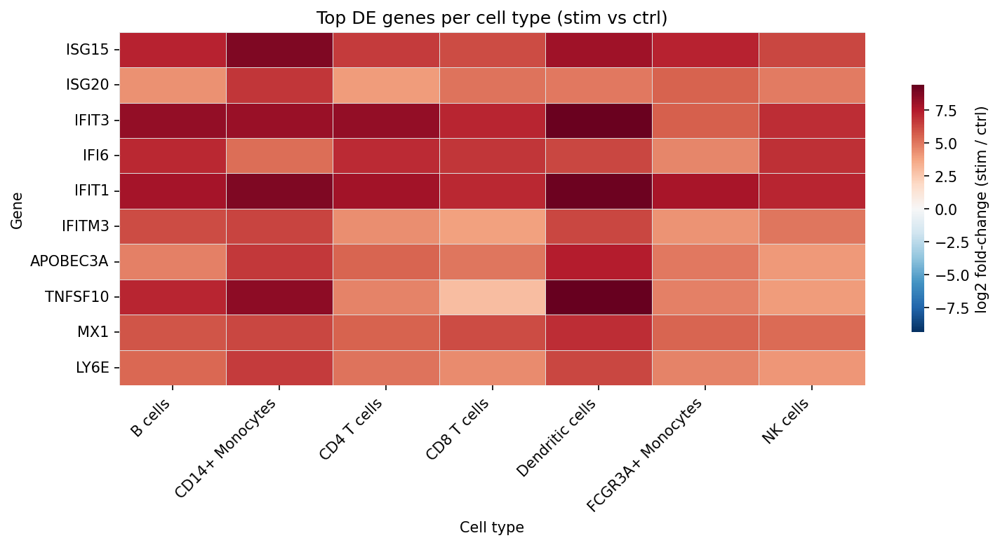
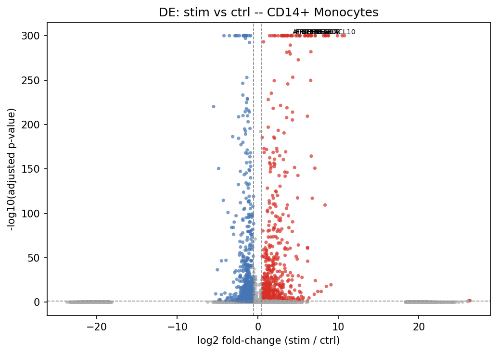
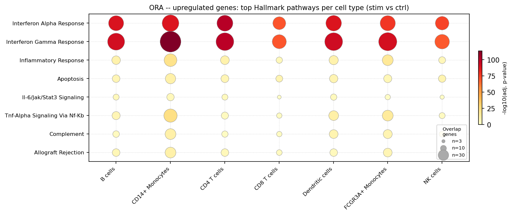

# sc-cell-state-benchmark

Benchmarking RNA-based cell-state scoring methods in single-cell RNA-seq, with layered biological interpretation using an interferon-stimulated PBMC dataset.

This repository focuses on RNA-only benchmarking and interpretation. Paired RNA+ATAC integration, TF/regulon inference, and dynamic regulatory modeling are developed separately in a follow-up multiome repository.

---

## Why this repo matters

* Benchmarks three gene-set scoring methods (scanpy score_genes, AUCell-style ranking, and custom) on a real IFN-β perturbation dataset with known ground truth, making method comparison biologically grounded.
* Connects method output directly to biological interpretation: within-cell-type DE, Hallmark pathway enrichment, and cell-cell communication -- not just cluster labels.
* Built for reproducibility: numbered scripts, fixed seeds, modular `src/` package, and a single `bash run_pipeline.sh` entrypoint.

---

## Highlights

### 1. Cell-type annotation and perturbation structure

* PBMC3k used as a warm-up dataset to validate QC, clustering, and annotation
* Kang PBMC dataset used to measure interferon-beta stimulation effects across cell types
* Donor mixing is acceptable overall, while condition is the dominant source of variation



*UMAP of the Kang PBMC dataset showing a strong separation between ctrl and IFN-β-stimulated cells while preserving expected immune cell types.*

### 2. Within-cell-type differential expression


*Top stimulated vs control genes within each cell type. Classical interferon-stimulated genes including IFIT1, IFIT3, ISG15, MX1, and IFI6 are consistently induced across immune populations, with the strongest response in monocytes and dendritic cells.*


*Volcano plot for CD14+ monocytes. IFN-β stimulation produces a broad transcriptional response dominated by interferon and inflammatory genes.*

### 3. Pathway-level interpretation


*ORA (over-representation analysis) on upregulated DEGs per cell type using MSigDB Hallmark gene sets. Interferon-α and interferon-γ responses dominate every cell type, while monocytes and dendritic cells additionally show TNF/NF-κB and inflammatory signaling.*

---

## What this repo demonstrates

* End-to-end single-cell RNA-seq preprocessing, clustering, and annotation
* Benchmarking of three gene-set scoring methods on a perturbation dataset
* Within-cell-type differential expression between stimulated and control cells
* Lightweight pathway enrichment for biological interpretation
* Optional exploratory cell-cell communication analysis
* Reproducible, numbered pipeline with fixed seeds and modular code

---

## Pipeline overview

| Layer                   | Scripts | Purpose                                                               |
| ----------------------- | ------- | --------------------------------------------------------------------- |
| PBMC3k warm-up          | 01–06   | QC, clustering, annotation, and validation on a standard PBMC dataset |
| Kang benchmark          | 07–09   | Interferon-response scoring and comparison of three scoring methods   |
| Program scoring         | 10      | Curated immune program scores across cell types and conditions        |
| Cell-cell communication | 11      | Exploratory ligand-receptor co-expression analysis                    |
| Differential expression | 12      | Stim vs ctrl differential expression within each cell type            |
Pathway enrichment | 13  | ORA (up/down) + preranked GSEA from DE genes |

---

## Datasets

| Dataset                     | Role                          | Cells  | Source |
| --------------------------- | ----------------------------- | ------ | ------ |
| PBMC3k (10x Genomics)       | Warm-up / pipeline validation | ~2,700 | `scanpy.datasets.pbmc3k()` |
| Kang PBMC IFN-β stimulation | Main benchmark dataset        | 24,562 | Expected locally at `data/raw/kang_pbmc_raw.h5ad` (original source: GEO GSE96583) |

---

## Main findings

* All three scoring methods separate stimulated from control cells with AUROC ≥ 0.985.
* Interferon-stimulated genes are strongly induced in every cell type, with the largest response in CD14+ monocytes and dendritic cells.
* Hallmark Interferon Alpha Response and Interferon Gamma Response are the dominant enriched pathways across all cell types.
* Monocytes and dendritic cells additionally show TNF-α signaling via NF-κB and inflammatory-response enrichment, indicating broader innate immune activation.

---

## Quick start

### Environment setup

```bash
# 1. Recreate the conda environment (Python + compiled dependencies)
conda env create -f environment.yml
conda activate sc-benchmark

# 2. Install the src/ package in editable mode so scripts can import sc_cell_state_benchmark modules
pip install -e .

# 3. Run the full pipeline
bash run_pipeline.sh
```

`environment.yml` pins the full conda environment for reproducibility.
`pyproject.toml` installs the `src/sc_cell_state_benchmark/` package so scripts can do
`from sc_cell_state_benchmark import scoring` without path hacks. Both files are intentional.

The pipeline expects the Kang PBMC dataset at `data/raw/kang_pbmc_raw.h5ad`
(GEO accession GSE96583). To use a file at a different path:

```bash
KANG_INPUT=/path/to/kang_pbmc_raw.h5ad bash run_pipeline.sh
```

Or run steps individually:

```bash
conda env create -f environment.yml
conda activate sc-benchmark
pip install -e .

python scripts/01_download_pbmc3k.py
python scripts/02_preprocess_pbmc3k.py
python scripts/03_plot_pbmc3k.py
python scripts/04_marker_genes.py
python scripts/05_annotate_clusters.py
python scripts/06_score_cell_states.py

python scripts/07_download_kang_pbmc.py
python scripts/08_preprocess_kang_pbmc.py
python scripts/09_score_kang_interferon.py --condition label --cell-type cell_type
python scripts/10_score_pathway_programs.py --condition label --cell-type cell_type
python scripts/11_cell_communication.py --condition label --cell-type cell_type
python scripts/12_de_per_cell_type.py --condition label --cell-type cell_type
python scripts/13_pathway_enrichment_per_cell_type.py
# canonical pathway script; 13_gsea_per_cell_type.py is deprecated
```

For the Kang dataset, the condition column is `label` (`ctrl`, `stim`) and the cell-type column is `cell_type`.

---

## Key outputs

| Step      | Main outputs                                                               |
| --------- | -------------------------------------------------------------------------- |
| Script 09 | `kang_interferon_vs_random_controls.png`, `kang_method_comparison.csv`     |
| Script 10 | `kang_program_heatmap_delta.png`, `kang_program_auc.csv`                   |
| Script 11 | `kang_communication_heatmap_delta.png`, `kang_communication_top_stim.csv`  |
| Script 12 | `kang_de_top5_per_cell_type.png`, `kang_de_stim_vs_ctrl_per_cell_type.csv` |
| Script 13 | `kang_ora_up_top_pathways.png`, `kang_ora_down_top_pathways.png`, `kang_gsea_preranked_top_pathways.png`, `kang_ora_up_results.csv`, `kang_ora_down_results.csv`, `kang_gsea_preranked_results.csv` |

---

## Repository structure

```text
sc-cell-state-benchmark/
├── data/
├── docs/
├── figures/
├── notebooks/
├── results/
├── scripts/
├── src/sc_cell_state_benchmark/   # importable package; installed via pip install -e .
├── tests/
├── environment.yml                # full conda environment pin for reproduction
├── pyproject.toml                 # package metadata and direct dependencies
├── run_pipeline.sh
└── README.md
```

---

## Limitations

* Results are based on a single in-vitro IFN-β stimulation dataset.
* Cell-cell communication analysis is exploratory and reflects ligand-receptor co-expression, not validated signaling.
* Megakaryocytes are present at very low cell numbers and should not be interpreted strongly.
* Additional implementation details and caveats are documented in `docs/IMPLEMENTATION_DECISIONS.md`.

---

## Future directions

Within this repository:

* additional scoring methods
* permutation-based null controls
* subsampling robustness analyses
* extra perturbation datasets
* richer gene-set loaders

Planned follow-up repository:

* paired RNA+ATAC integration
* WNN-based multimodal analysis
* TF / regulon inference
* dynamic regulatory modeling and pseudotime

---

## Development

```bash
pytest tests/
```
