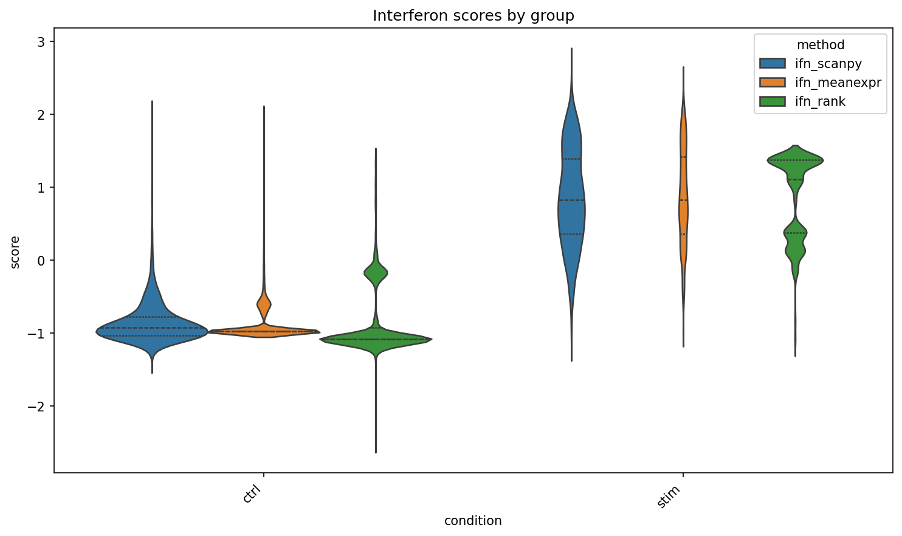

# sc-cell-state-benchmark

Benchmarking interpretable RNA-based cell-state scoring methods on single-cell
perturbation data.

This repository compares Scanpy score_genes, mean-expression scoring,
AUCell-style scoring, and UCell-style scoring on the Kang PBMC IFN-β
stimulation dataset. The benchmark extends beyond AUROC by adding
cell-type-level program scoring, differential expression, Hallmark pathway
enrichment, and exploratory ligand-receptor co-expression.

RNA-only by design. Multiome RNA+ATAC integration and TF/regulon analysis are
kept in a separate follow-up repository.

---

## Main findings

- All four scoring methods detected the IFN-β stimulation signal, with
  near-ceiling AUROC for the interferon program in this strong perturbation
  benchmark.

- IFN-α/β response increased across major PBMC populations, with strongest
  score changes in CD14+ monocytes, dendritic cells, and FCGR3A+ monocytes.

- Within-cell-type DE recovered canonical interferon-stimulated genes including
  ISG15, ISG20, IFI6, IFIT-family genes, and MX1.

- Hallmark enrichment confirmed interferon alpha/gamma response as the dominant
  upregulated pathway signal, with secondary inflammatory and TNF/NF-kB terms in
  selected innate immune populations.

---

## Representative figures



*Interferon scores separate stimulated and control cells across scoring methods.*


*Stimulated-minus-control immune program score changes by cell type.*


*Hallmark ORA confirms interferon alpha/gamma response enrichment across cell types.*


*Exploratory ligand-receptor co-expression suggests candidate myeloid-to-lymphoid
communication changes after stimulation.*

---

## Pipeline

| Layer | Scripts | Purpose |
| --- | --- | --- |
| PBMC3k warm-up | 01–05 | QC, clustering, marker inspection, and annotation |
| IFN scoring setup | 06–09 | Implement scoring methods and benchmark Kang ctrl vs stim |
| Immune program scoring | 10 | Score curated immune programs by condition and cell type |
| Cell-cell communication | 11 | Exploratory ligand-receptor co-expression |
| Differential expression | 12 | Stim vs ctrl DE within each cell type |
| Pathway enrichment | 13 | ORA and preranked GSEA from DE results |

---

## Quick start
```bash
conda env create -f environment.yml  
conda activate sc-benchmark  
pip install -e .  
bash run_pipeline.sh
```
The Kang PBMC dataset is expected at:

data/raw/kang_pbmc_raw.h5ad

To run individual Kang benchmark steps:
```bash
python scripts/08_preprocess_kang_pbmc.py  
python scripts/09_score_kang_interferon.py --condition label --cell-type cell_type  
python scripts/10_score_pathway_programs.py --condition label --cell-type cell_type  
python scripts/11_cell_communication.py --condition label --cell-type cell_type  
python scripts/12_de_per_cell_type.py --condition label --cell-type cell_type  
python scripts/13_pathway_enrichment_per_cell_type.py
```
---

## Datasets

| Dataset | Role | Cells | Source |
| --- | --- | ---: | --- |
| PBMC3k | Warm-up / pipeline validation | ~2,700 | scanpy.datasets.pbmc3k() |
| Kang PBMC IFN-β | Main perturbation benchmark | ~24,560 | GEO GSE96583 |

---

## Notes and limitations

- The Kang IFN-β dataset is a strong perturbation benchmark, so AUROC values may approach the ceiling and may not distinguish methods on subtler signals.

- Ligand-receptor analysis is expression-based and exploratory. It does not prove secretion, binding, spatial proximity, or downstream signaling.

- Pathway enrichment summarizes DE genes and should not be interpreted as direct measurement of pathway activity.

- Megakaryocytes are present at low numbers and are not interpreted strongly.

- Additional implementation details are documented in docs/IMPLEMENTATION_DECISIONS.md.
